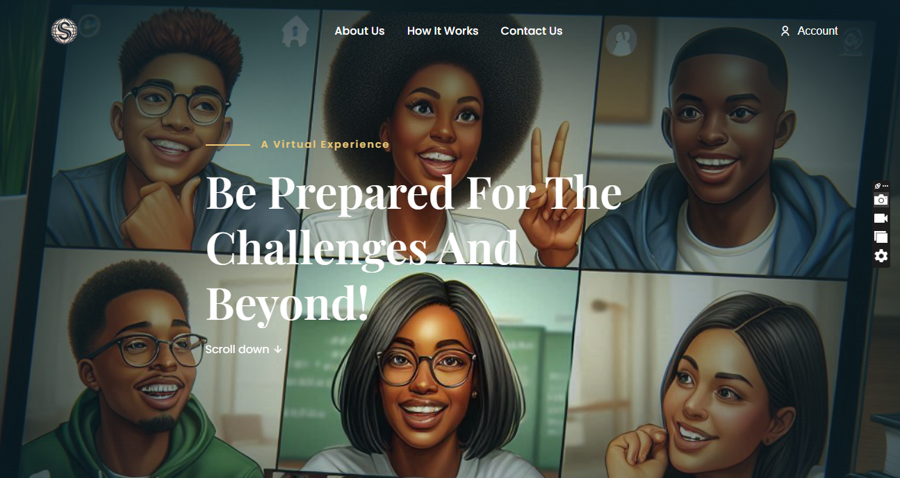
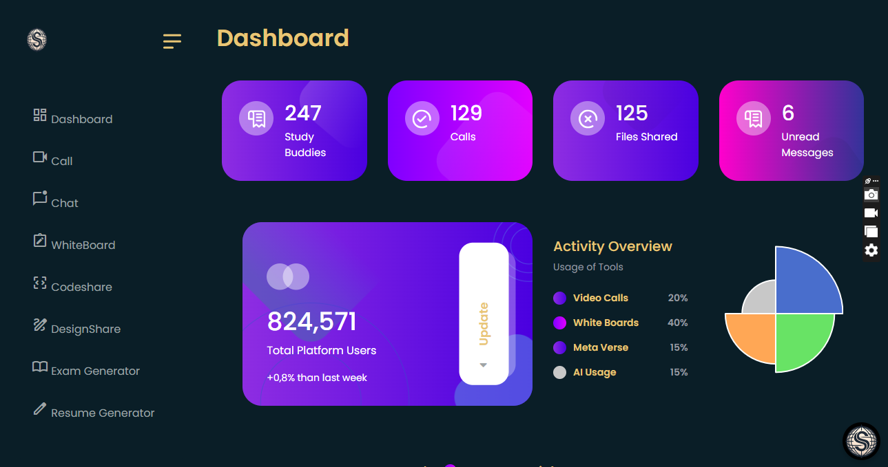
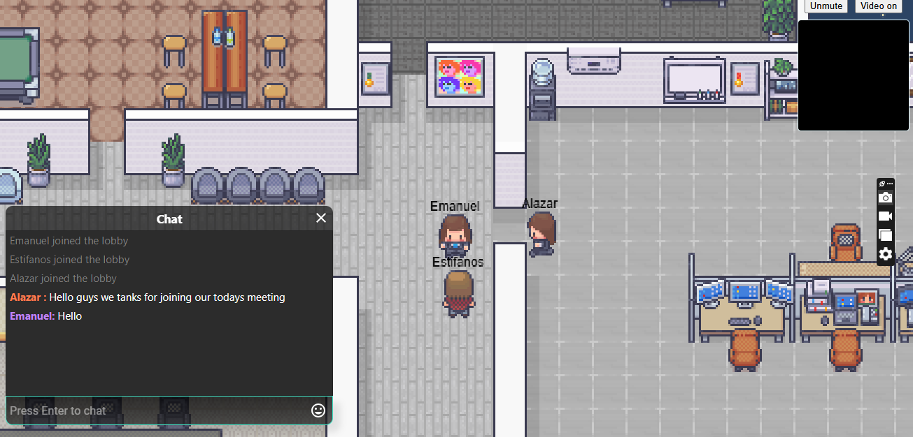
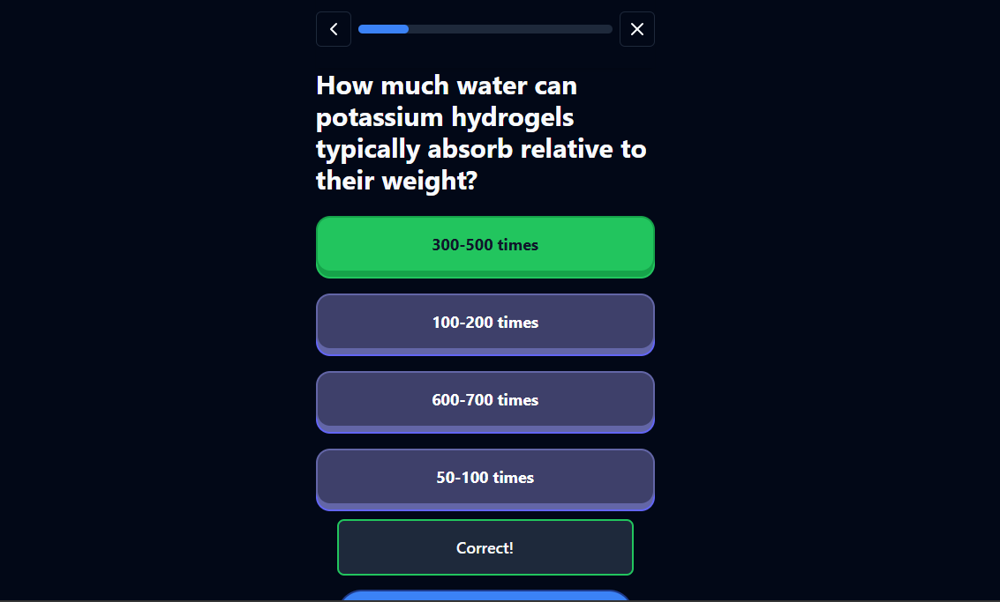

# Study-sphere



 

## Overview
Study-sphere is an innovative collaborative learning and Working platform designed to address the challenges of scattered learning and facilitate seamless collaboration among students, researchers, and teachers. Our platform integrates various features to enhance interaction, productivity, and engagement in both physical and remote environments.

## Features
- Video Conferencing: Real-time communication for effective collaboration.
- Metaverse: An immersive virtual environment for enhanced interaction.
- Collaborative Coding Platform: Code together in real-time with peers.
- Whiteboard: A digital space for brainstorming and visual collaboration.
- Collaborative Designer: Joint design efforts made easy.
- Exam Generator: Automated creation of assessments and quizzes.
- Voice Control: Hands-free navigation and operation.
- AI Helping Bot  : Assistance and answers powered by AI.
- Resume Builder  : Create professional resumes effortlessly.

## Technical Stack
-   Frontend  : HTML, CSS, JavaScript, Next.js, Vite
-   Backend  : Drizzler, MySQL,Socet.io
-   AI and Integration  : OPENAI, Clerck, ZegoCloud, AlanAI, Chatbase AI
-   Programming  : TypeScript, Supabase
-   Next-auth - Authentication
-   Shadcn ui - ui library
-   Open Al - AI Integration
-   Langchain - LLM Framework
-   Drizzle - Orm
-   PostgreSQL - Database
-   Supabase - Database hosting
-   Stripe - Payments
-   Tanstack - Table
-   Typescript - Type Checking
-   Vercel - Deployment
-   Stripe - Payments
-   Zod - Schema Validation
-   Liveblocks
-   Fabric.js


## Target Audience
-   Primary  : Students, researchers, and teachers.
-   Future Potential  : Educational institutions.

## Monetization Strategies
- Subscription model with tiered options.
- Per-user pricing.
- Enterprise licensing for institutions.
- Data monetization through anonymized insights.
- Partnerships for grants and funding.
- Flexible payment plans for educational financing.
- Open-source edition for community involvement.


## Contact
For inquiries, please reach out to us at e3stif@gmail.com.


## How to Run 
## For the white board, go to /Whitebophir then run 
``` 
npm install --production
```

Finally, you can start the server:

```
PORT=5001 npm start
```
## For the Metaverse, go to /SkyOffice then run 
To start a server, go into the project folder and install dependencies/run start command:

```bash
cd SkyOffice or 'my-folder-name'
yarn && yarn start
```

To start a client, go into the client folder and install dependencies/run start command:

```bash
cd SkyOffice/client or 'my-folder-name/client'
yarn && yarn dev
```
# Controls

- `W, A, S, D, or arrow keys` to move (video chat will start if you are close to someone else)
- `E` to sit down
- `R` to use computer (for screen sharing)
- `Enter` to open chat
- `ESC` to close chat

## For the Exam Generator, go to /quizz-ai-tutorial-complete then run 
```bash
npm run dev
# or
yarn dev
# or
pnpm dev
# or
bun dev
```

## For the Collaborative Design , go to /figma-ts
```bash
npm install
```

## For the codeshare, go to /codeshare then run 
```bash
npm run dev
# or
yarn dev
# or
pnpm dev
# or
bun dev
```

## For the clerk-authentication, go to /clerk-javascript-quickstart then run 
`npm run dev`

Thank you for your interest in Study-sphere!


